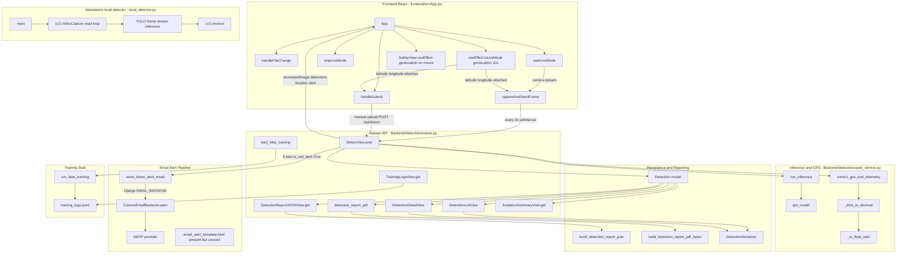

# Function-by-Function Architecture Diagram

## Scope Confirmed From Project Files
- Frontend: React (`frontend/src/App.jsx`) calls REST API with `axios`.
- Backend: Django + DRF (`Backend/detections/views.py`) serves detection, reporting, analytics, and fake training logs.
- Model runtime: Ultralytics YOLO (`Backend/detections/yolo_service.py`) with weights `best.pt`.
- OpenCV path: local standalone webcam detector (`local_detector.py`) using `cv2.VideoCapture(0)` + YOLO.
- Email alerts: custom SMTP backend + alert service (`drone_backend/email_backend.py`, `detections/email_service.py`).
- Live/recurring alerts: polling loop in frontend (`setInterval` every 2s) repeatedly posts frames to `/api/detect/`.
- WebSocket status: no runtime WebSocket implementation in source; live updates are polling-based.

## End-to-End Function Graph

## Recurring Safety Alert Loop
1. `startLiveMode` opens camera and starts a 2-second timer.
2. `captureAndSendFrame` sends each frame to `POST /api/detect/`.
3. `DetectView.post` calls `run_inference`, computes alert, stores `Detection`.
4. If `is_red_alert == True` (`drone_max_confidence >= 0.85`), `send_drone_alert_email` sends an SMTP alert.
5. Loop repeats, so alerts can recur for consecutive high-confidence frames.

## WebSocket Reality
- Implemented: REST polling (`setInterval` + `axios.post`) for near-real-time updates.
- Not implemented in runtime: `WebSocket`, `Django Channels`, SSE endpoint, socket server.

## Function Inventory By File
- `local_detector.py`: `main`.
- `Backend/manage.py`: `main`.
- `Backend/detections/yolo_service.py`: `get_model`, `_to_float_ratio`, `_dms_to_decimal`, `extract_gps_and_telemetry`, `run_inference`.
- `Backend/detections/views.py`: `DetectView.post`, `DetectionListView`, `DetectionDetailView`, `DetectionReportJSONView.get`, `detection_report_pdf`, `AnalyticsSummaryView.get`, `start_fake_training`, `TrainingLogsView.get`.
- `Backend/detections/email_service.py`: `send_drone_alert_email`.
- `Backend/detections/reporting.py`: `build_detection_report_json`, `build_detection_report_pdf_bytes`.
- `Backend/detections/training_stub.py`: `run_fake_training`.
- `Backend/detections/models.py`: `Detection.__str__`.
- `Backend/detections/serializers.py`: `DetectionSerializer.get_image_url`.
- `Backend/drone_backend/email_backend.py`: `CustomEmailBackend.open`.
- `Backend/test_email.py`: `test_email_direct`.
- `Backend/debug_detection.py`: `test_detection_email`.
- `frontend/src/App.jsx` components/functions: `UploadCloudIcon`, `LocationIcon`, `TagIcon`, `XIcon`, `ShieldIcon`, `InfoIcon`, `ChevronLeftIcon`, `ChevronRightIcon`, `GlassPanel`, `Navbar`, `NavItem`, `LoginModal`, `ImageCarousel`, `LiveDetectionOverlay`, `HomeView`, `DescriptionView`, `SafetyView`, `Footer`, `App`, plus inner functions in `App`:
  `handleFileChange`, `handleSubmit`, `triggerFileSelect`, `handleBeginDetect`, `captureAndSendFrame`, `startLiveMode`, `stopLiveMode`, and two `useEffect` geolocation loops.
